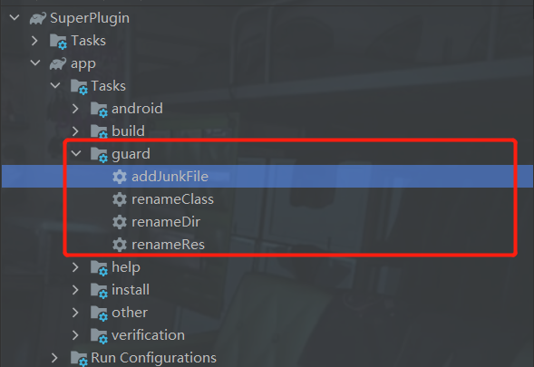

# ClassResGuard

## 前言

改过马甲包的都知道每次修改都需要修改大量文件名称,ClassResGuard由此而来,一键修改className,resName,添加垃圾文件
下面会有详细介绍,修改完所有引用的地方都会一键替换成最新修改的,修改layout名称的同时可以修改class中相对应的binding名称
一键添加垃圾类(普通java class,Activity class,layout,drawable,并且Activity会
自动在AndroidManifest.xml里注册,还会绑定生成的垃圾xml), 下面会有详细介绍.

如果觉得此库不能满足你的需求可以看看[XmlClassGuard](https://github.com/liujingxing/XmlClassGuard)

## 警告警告⚠️

由于是在本地操作，任务执行是不可逆的，故务必做好代码备份，否则代码将很难还原

## 使用

1.在setting.gradle里配置

```
pluginManagement {
    repositories {
        maven { url 'https://jitpack.io' }
    }
}
```

2.在build.gradle(project)中配置

```
buildscript {
    dependencies {
        classpath "com.github.coolxinxin:ClassResGuard:1.0.6"
    }
}
```

3.在build.gradle(app)中配置

```
apply plugin: "class-res-guard"

//以下前缀名称为必须，可参考以下配置
classResGuard {
    //renameClass Task
    //Class的前缀名称,固定前缀配单个,随机前缀配置需要随机的前缀数组["Large","SuperT"]
    classPrefixName = ["Leo"]
    //renameDir Task
    //dir的前缀名称,配置同上
    dirPrefixName = ["leo"]
    //renameRes Task
    //res的前缀名称,配置同上
    resPrefixName = ["leo_ta"]
    //需要修改的res文件目录
    changeResDir = ["drawable", "layout", "mipmap-hdpi"]
    //addJunkFile Task
    //生成java垃圾文件的目录,可以配置不存在的目录
    junkPackage = "com.leos.superplugin.junk"
    //需要导入的R资源文件包,切记不要配错,否则垃圾文件中的R资源文件包需要自己手动导入
    junkResPackage = "com.leos.superplugin"
    //生成java Activity垃圾文件中的方法数
    activityClassMethodCount = 10
    //生成java Activity文件的数量
    activityClassCount = 1
    //生成java 普通垃圾文件中的方法数
    normalClassMethodCount = 0
    //生成java 普通文件的数量
    normalClassCount = 0
    //生成layout文件的数量
    layoutClassCount = 1
    //生成layout文件中view的数量
    layoutClassMethodCount = 10
    //生成drawable文件的数量
    drawableClassCount = 0
    //添加color资源的数量 values/color.xml
    colorCount = 10
    //添加string资源的数量 values/strings.xml
    stringsCount = 10
    //color的前缀名称,colorCount>0时,必须配置
    colorPrefixName = ["leo"]
    //strings的前缀名称,可配可不配
    stringsPrefixName = [""]
}
```

如图看到以下任务




## 任务介绍

分别是addJunkFile,renameClass,renameDir,renameRes这4个任务之间没有任何关系，下面将一一介绍这些任务的功能

### 1.addJunkFile

该任务是一个添加垃圾文件的任务,添加一些垃圾资源降低Google的代码查重率

```
classResGuard {
   //生成java垃圾文件的目录,可以配置不存在的目录
    junkPackage = "com.leos.superplugin.junk"
    //需要导入的R资源文件包,切记不要配错,否则垃圾文件中的R资源文件包需要自己手动导入
    junkResPackage = "com.leos.superplugin"
    //生成java Activity垃圾文件中的方法数
    activityClassMethodCount = 10
    //生成java Activity文件的数量
    activityClassCount = 1
    //生成java 普通垃圾文件中的方法数
    normalClassMethodCount = 0
    //生成java 普通文件的数量
    normalClassCount = 0
    //生成layout文件的数量
    layoutClassCount = 1
    //生成layout文件中view的数量
    layoutClassMethodCount = 10
    //生成drawable文件的数量
    drawableClassCount = 0
    //添加color资源的数量 values/color.xml
    colorCount = 10
    //添加string资源的数量 values/strings.xml
    stringsCount = 10
    //color的前缀名称,colorCount>0时,必须配置
    colorPrefixName = ["leo"]
    //strings的前缀名称,可配可不配
    stringsPrefixName = [""]
}
```

### 2.renameClass

该任务是一个修改class文件的任务,在所有的class类名前加前缀,需要固定前缀配单个,需要随机前缀配置多个前缀,如["Large","SuperT"]

```
classResGuard {
   //Class的前缀名称,固定前缀配单个,随机前缀配置需要随机的前缀数组["Large","SuperT"]
    classPrefixName = ["Leo"]
}
```

### ~~3.renameDir~~

该任务是一个修改文件夹名称的目录,注:只修改有文件的文件夹目录,没文件的目录不会被修改

```
classResGuard {
    //dir的前缀名称,配置同上
    dirPrefixName = ["leo"]
}
```

### 4.renameRes

该任务是一个修改res资源文件的任务,class中的binding名称也会相对应的修改,无需手动修改任何文件

```
classResGuard {
   //res的前缀名称,配置同上
    resPrefixName = ["leo_ta"]
    //需要修改的res文件目录
    changeResDir = ["drawable", "layout", "mipmap-hdpi"]
}
```

